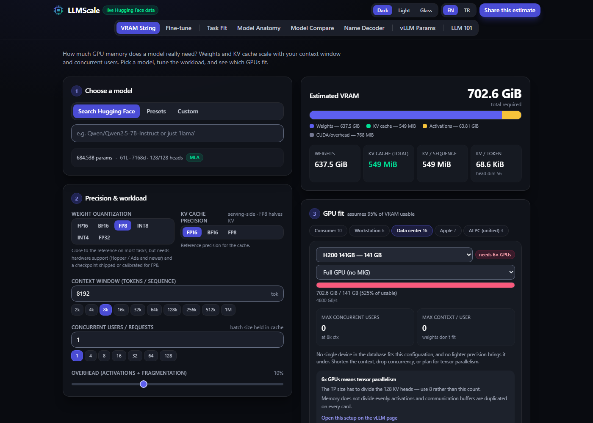
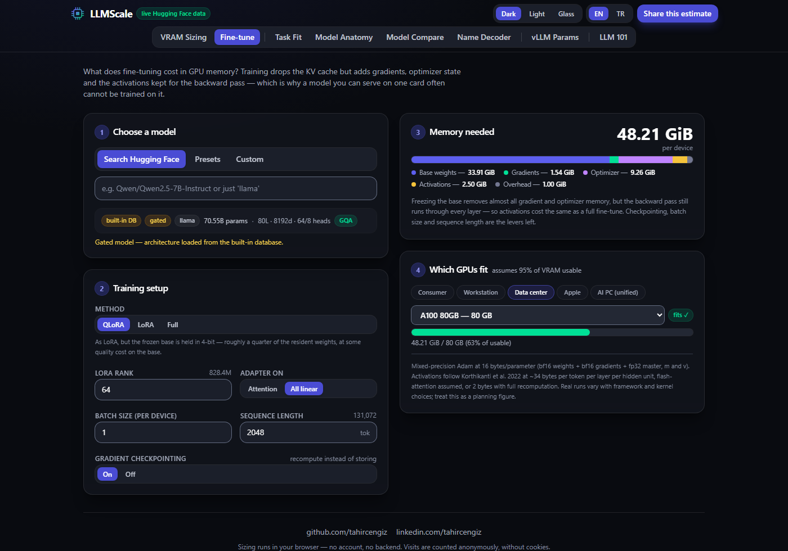
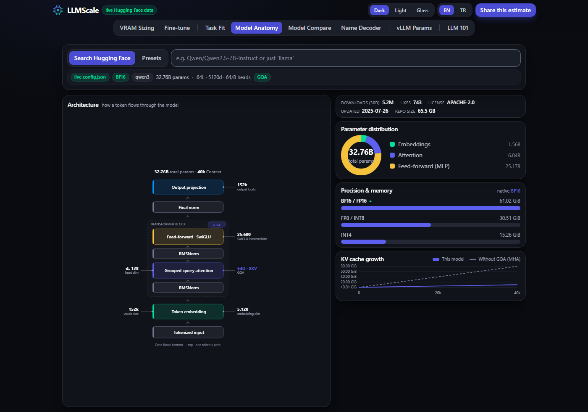

# LLMScale

**How much GPU memory does an LLM actually need — and what runs it?**

A fast, client-side calculator that models the terms `params × 2` misses, and
names every assumption it makes.

🔗 **[tahircengiz.github.io/LLMScale](https://tahircengiz.github.io/LLMScale/)** — no account, no backend, no install.
In Turkish: **[/tr/](https://tahircengiz.github.io/LLMScale/tr/)**.



## What it accounts for

| | |
|---|---|
| **Weights** | at FP32, FP16/BF16, FP8, INT8 or INT4 — detected from the repo's `quantization_config`, its name, `torch_dtype` or safetensors header |
| **KV cache** | scaled by context window × concurrent users, using each model's **real GQA layout** |
| **MLA** | DeepSeek's multi-head latent attention caches one compressed latent per layer, not a K/V pair per head — worth ~25× on V3 |
| **MoE** | every expert stays resident; decode speed reads only the *active* ones — from the model card for presets, worked out from `config.json` for any other model |
| **Overhead** | a stated share of weights + KV cache (10% by default, adjustable) plus 0.75 GiB of CUDA context |
| **GPU fit** | which cards hold it, how many users fit, the maximum context for one user, and a bandwidth-bound decode speed |

Architecture is pulled **live from the Hugging Face Hub**. Gated repos (Llama,
Gemma, Mistral) can't be read from a browser, so their configs ship in a bundled
database alongside a curated preset list. Repos with no config of their own —
GGUF forks, for instance — are resolved through their `base_model` lineage, and
the page says so.

## Eight tools

| | |
|---|---|
| **VRAM Sizing** | the calculator |
| **Fine-tune** | LoRA, QLoRA and full fine-tune memory — gradients, optimizer state, activations |
| **Task Fit** | is this model right for chat, code, RAG, agents, vision…? Transparent rule-based scoring |
| **Model Anatomy** | a visual X-ray: parameter distribution, weight size at each precision, GQA head grouping, KV growth |
| **Model Compare** | 2–4 models side by side |
| **Name Decoder** | what 70B, A3B, AWQ, GGUF, FP8, MXFP4 actually mean |
| **vLLM Params** | a tuned `vllm serve` command with per-flag rationale |
| **LLM 101** | an interactive walkthrough of how a language model works |



## And the guides around them

Every tool ships its content in the HTML — prerendered at build time, with a
short explainer and questions underneath — and the build generates guides from
the same engine, so a page cannot disagree with the calculator it links into:

| | |
|---|---|
| **Model pages** | one per preset: memory by precision and context, the GPUs that hold it, concurrent users, fine-tuning memory |
| **GPU pages** | the cards people search for: every preset at BF16, FP8 and INT4, with users and maximum context |
| **Concept guides** | KV cache size; GQA, MQA and MLA; quantization and VRAM — every number in them computed, not typed |

Each page has an English and a Turkish address (`/tr/…`), tied together with
hreflang. Nothing redirects by language: a visitor whose preference differs from
the page's is offered the other version, and chooses.

## The numbers are checked, not asserted

The figures that decide the answer are checked against published results, and
each check is a permanent test:

- **Mixed-precision Adam at 16 bytes/parameter** — the ZeRO paper's `2Ψ+2Ψ+12Ψ`.
- **QLoRA fine-tunes a 65B model on one 48 GB card** — the engine puts it at
  43.3 GiB. Checking this found two real errors: an FFN width that was guessed
  rather than read, and NF4 at 0.55 bytes instead of 0.516.
- **MLA caches `(d_c + d_h^R)·l` per token** — DeepSeek-V2 §2.1.3, which also
  states it equals "GQA with only 2.25 groups". Both are tests.
- **gpt-oss-120b fits a single 80 GB GPU** — its own model card. 61.2 of 76.0
  usable GiB at 4-bit.
- **MoE active parameters** — estimated from the real configs and held to their
  model cards: Qwen3-30B-A3B at 3.35B against 3.3B, Mixtral 8x7B at 12.88B
  against 12.9B.

The suites run through Node's type stripping, without a build step:

```bash
npm run test:all          # every suite
npm test                  # the VRAM engine
npm run test:mla          # multi-head latent attention, against the paper
npm run test:moe          # MoE active parameters, against model cards
npm run test:train        # fine-tuning memory
npm run test:invariants   # guards against silent drift between lists
```



## How it works

| Component | Formula |
|---|---|
| Weights | `params × bytes_per_param` |
| KV cache (GQA/MHA) | `2 × layers × kv_heads × head_dim × bytes × context × concurrency` |
| KV cache (MLA) | `layers × (kv_lora_rank + qk_rope_head_dim) × bytes × context × concurrency` |
| Overhead | `(weights + kv) × overhead% + cuda_context` |
| Decode speed | `bandwidth × 0.8 ÷ (active_params × bytes + kv_cache of the batch)` |

GPU fit budgets a discrete card at 95% of its memory, leaving the rest to the
driver. Unified-memory devices are budgeted at the share their GPU can address
by default rather than the whole pool — 75% on Apple Silicon, 96 of 128 GB on
Strix Halo, 120 of 128 GB on DGX Spark.

> These are **planning figures, not guarantees**. Real usage depends on the
> serving engine — vLLM, TGI, llama.cpp — and on paged-attention efficiency.
> Prefill (time to first token) is not modelled, and neither are sliding-window
> layers (Gemma 2, gpt-oss), which cache less than the formula counts.

## Privacy

The **calculation** runs in your browser: there is no backend and no account, so
nothing is sent anywhere to be computed. Visits are counted anonymously and
without cookies via self-hosted [Umami](https://umami.is/). Note that the app
keeps its state in the URL, so the model and settings you pick are part of what
that counter receives.

## Tech

Vite · React 19 · TypeScript · Tailwind CSS v4. Three themes — dark, light, and
a translucent "glass" material. English and Turkish, each at its own address. No
runtime dependencies beyond React (plus Three.js, code-split into the LLM 101
page alone). The build and the tests run TypeScript directly, so they need a
Node with type stripping on by default (22.18 or newer).

```bash
npm install
npm run dev        # local dev server (serves /tr/ paths from the English entries)
npm run typecheck
npm run build      # → dist/: the app prerendered in both languages, the guides, sitemap.xml
npm run deploy     # → gh-pages branch
```

## Licence

[GNU AGPL-3.0-only](LICENSE). The tool is free to use and always will be.

AGPL rather than MIT for one reason: LLMScale is a hosted web app, and section 13
covers exactly that case. Run a modified copy for other people over a network and
you owe those users the source of your version. Use it, fork it, learn from the
KV-cache maths — just don't build a closed product on top of it.

Built by [Tahir Cengiz](https://github.com/tahircengiz).
